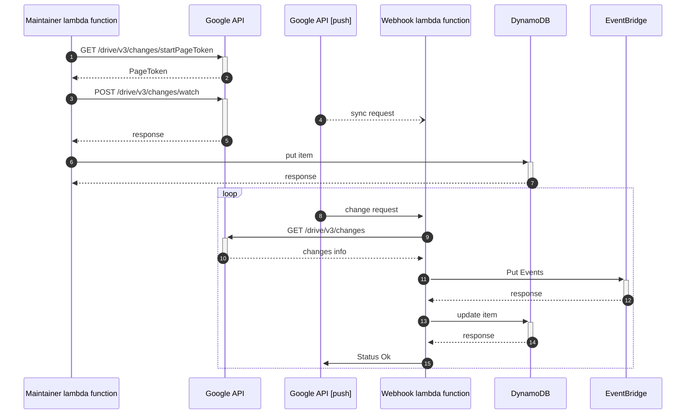

# gdnotify

[](https://godoc.org/github.com/mashiike/gdnotify)


[](https://github.com/mashiike/gdnotify/blob/master/LICENSE)

`gdnotify` is google drive change notifier for AWS

Changes that occur in Google Drive are notified through Amazon EventBridge.

## Install 
### Homebrew (macOS and Linux)

```console
$ brew install mashiike/tap/awstee
```
### Binary packages

[Releases](https://github.com/mashiike/awstee/releases)

## Usage with AWS Lambda (serverless)

gdnotify works with AWS Lambda, Amazon EventBridge and Amazon DynamoDB.

Lambda Function requires a webhook and a maintainer





The basic configuration file is as follows:
```yaml
required_version: ">=0.0.0"

webhook: "{{ env `WEBHOOK_LAMBDA_URL`}}" #webhook mode lambda function URL
expiration: 168h

storage:
  type: DynamoDB
  table_name: gdnotify # DynamoDB Table Name

notification:
  type: EventBridge
  event_bus: gdnotify # Event Bus Name. Although it is possible to use the `default`, it is recommended to create and use a custom event bus.

drives:
  - drive_id: __default__   # __default__ is a special setting, indicating a drive that is not tied to a specific Drive, 
                            # but can be sensed with the given permissions. (For example, files that reside in MyDrive)
  - drive_id: XXXXXXXXXXXXXXXXXXX  # Usually, you should specify the DriveID of the team drive
```

Let's solidify the Lambda package with the following configuration (runtime `provided.al2`)

```
lambda.zip
├── bootstrap    # build binary
└── config.yaml  # configuration file
```

A related document is [https://docs.aws.amazon.com/lambda/latest/dg/runtimes-custom.html](https://docs.aws.amazon.com/lambda/latest/dg/runtimes-custom.html)

### Webhook lambda function 

The Webhook's Lambda function receives notifications from the Google API. It then puts the Event into the EventBus of Amazon EventBridge.

Set the following environment variables:

- `GDNOTIFY_RUN_MODE`=webhook
- `GDNOTIFY_CONFIG`=config.yaml

The required IAM Role permissions are as follows.
```json
{
    "Version": "2012-10-17",
    "Statement": [
        {
            "Sid": "Webhook",
            "Effect": "Allow",
            "Action": [
                "events:PutEvents",
                "dynamodb:DescribeTable",
                "dynamodb:GetItem",
                "dynamodb:UpdateItem"
            ],
            "Resource": [
                "*"
            ]
        }
    ]
}
```

It is necessary to set up a Lambda Function URL, or API gateway, ALB, etc.
Here, the Lambda Function URL is assumed to be simple.
lambda function URLs document is [https://docs.aws.amazon.com/lambda/latest/dg/lambda-urls.html](https://docs.aws.amazon.com/lambda/latest/dg/lambda-urls.html)
Suppose you get the following URL: `https://xxxxxxxxxxxx.lambda-url.ap-northeast-1.on.aws`

### Maintainer lambda function
Maintainer's Lambda function registers a notification channel with the Google API. It is assumed that this Lambda function will be called at regular intervals to perform maintenance tasks such as re-registering those newly added to the monitoring or those about to expire at that time.

Set the following environment variables:

- `GDNOTIFY_RUN_MODE`=maintainer
- `GDNOTIFY_CONFIG`=config.yaml
- `WEBHOOK_LAMBDA_URL`=https://xxxxxxxxxxxx.lambda-url.ap-northeast-1.on.aws

The required IAM Role permissions are as follows.
```json
{
    "Version": "2012-10-17",
    "Statement": [
        {
            "Sid": "Webhook",
            "Effect": "Allow",
            "Action": [
                "dynamodb:CreateTable",
                "dynamodb:PutItem",
                "dynamodb:DeleteItem",
                "dynamodb:Scan"
            ],
            "Resource": [
                "*"
            ]
        }
    ]
}
```

EventBridge scheduling rules are required.
The following tutorial will help you set it up. https://docs.aws.amazon.com/eventbridge/latest/userguide/eb-run-lambda-schedule.html

## Usage as CLI

```shell
gdnotify -config <config file> [options] [command]
version: v0.0.0

commands:
   list          list notification channels
   serve         serve webhook server
   register      register a new notification channel for a drive for which a notification channel has not yet been set
   maintenance   re-register expired notification channels or register new unregistered channels.
   cleanup       remove all notification channels

options:
  -config value
        config list
  -log-level string
        run mode (default "info")
  -port int
        webhook httpd port
  -run-mode string
        run mode (cli|webhook|maintainer) (default "cli")
```

## For Local Development

```yaml
required_version: ">=0.0.0"

webhook: "{{ env `HTTP_TUNNEL_URL` }}"
expiration: 168h

storage:
  type: File
  data_file: data/storage.gob

notification:
  type: File
  event_file: data/events.json

drives:
  - drive_id: __default__
```

It can be run locally using the cloudflare tunnel command or ngrok.
For example

```shell
$ HTTP_TUNNEL="cloudflared tunnel --url localhost{{ .Address }}" GDNOTIFY_RUN_MODE=webhook go run cmd/gdnotify/main.go -config local.yaml -log-level debug
```

see `tunnel.log`, get tunnel url 

```shell 
$  HTTP_TUNNEL_URL="https://..." go run cmd/gdnotify/main.go -config my-local/local.yaml -log-level debug maintenance
$  HTTP_TUNNEL_URL="https://..." go run cmd/gdnotify/main.go -config my-local/local.yaml -log-level debug list
$  HTTP_TUNNEL_URL="https://..." go run cmd/gdnotify/main.go -config my-local/local.yaml -log-level debug cleanup
```

## LICENSE

MIT License

Copyright (c) 2022 IKEDA Masashi
