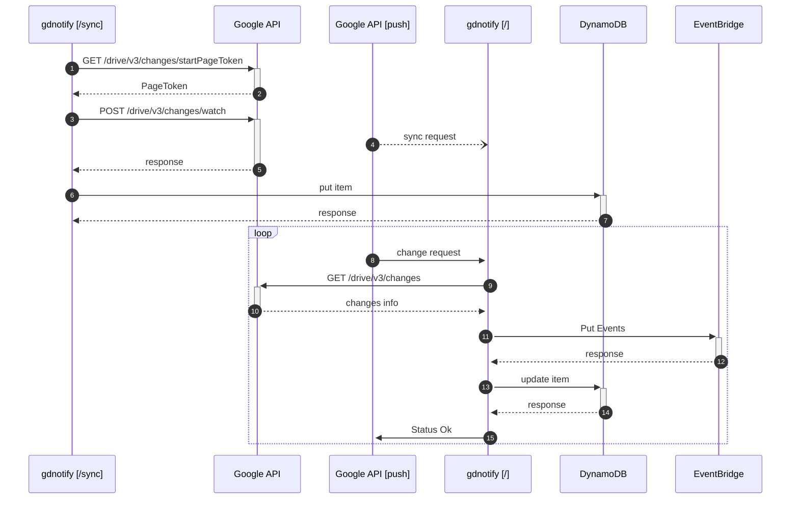

# gdnotify

[](https://godoc.org/github.com/mashiike/gdnotify)


[](https://github.com/mashiike/gdnotify/blob/master/LICENSE)

`gdnotify` is a Google Drive change notifier for AWS.

Changes that occur in Google Drive are notified through Amazon EventBridge.

## Install 
### Homebrew (macOS and Linux)

```console
$ brew install mashiike/tap/awstee
```
### Binary packages

[Releases](https://github.com/mashiike/awstee/releases)

## Usage 

```
$ gdnotify -h
Usage: gdnotify <command> [flags]

gdnotify is a tool for managing notification channels for Google Drive.

Flags:
  -h, --help                                         Show context-sensitive help.
      --log-level="info"                             log level ($GDNOTIFY_LOG_LEVEL)
      --log-format="text"                            log format ($GDNOTIFY_LOG_FORMAT)
      --[no-]log-color                               enable color output ($GDNOTIFY_LOG_COLOR)
      --version                                      show version
      --storage-type="dynamodb"                      storage type ($GDNOTIFY_STORAGE_TYPE)
      --storage-table-name="gdnotify"                dynamodb table name ($GDNOTIFY_DDB_TABLE_NAME)
      --[no-]storage-auto-create                     auto create dynamodb table ($GDNOTIFY_DDB_AUTO_CREATE)
      --storage-dynamo-db-endpoint=STRING            dynamodb endpoint ($GDNOTIFY_DDB_ENDPOINT)
      --storage-data-file="gdnotify.dat"             file storage data file ($GDNOTIFY_FILE_STORAGE_DATA_FILE)
      --storage-lock-file="gdnotify.lock"            file storage lock file ($GDNOTIFY_FILE_STORAGE_LOCK_FILE)
      --notification-type="eventbridge"              notification type ($GDNOTIFY_NOTIFICATION_TYPE)
      --notification-event-bus="default"             event bus name (eventbridge type only) ($GDNOTIFY_EVENTBRIDGE_EVENT_BUS)
      --notification-event-file="gdnotify.json"      event file path (file type only) ($GDNOTIFY_EVENT_FILE)
      --webhook=""                                   webhook address ($GDNOTIFY_WEBHOOK)
      --expiration=168h                              channel expiration ($GDNOTIFY_EXPIRATION)
      --within-modified-time=WITHIN-MODIFIED-TIME    within modified time, If the edit time is not within this time, notifications will not be sent ($GDNOTIFY_WITHIN_MODIFIED_TIME).

Commands:
  list [flags]
    list notification channels

  serve [flags]
    serve webhook server

  cleanup [flags]
    remove all notification channels

  sync [flags]
    force sync notification channels; re-register expired notification channels,register new unregistered channels and get all new notification

Run "gdnotify <command> --help" for more information on a command.
```

Refer to the following document to prepare the permissions for Google Cloud. Please enable the Google Drive API v3 in the corresponding Google Cloud in advance.
https://cloud.google.com/docs/authentication/application-default-credentials

Start the server with `gdnotify` as follows.

```
$ go run cmd/gdnotify/main.go --storage-auto-create                  
time=2025-03-13T19:29:17.799+09:00 level=INFO msg="check describe dynamodb table" table_name=gdnotify
time=2025-03-13T19:29:18.379+09:00 level=INFO msg="starting up with local httpd :25254"
```

By default, the server will start at `:25254`. By specifying the `--storage-auto-create` option, the DynamoDB table will be created automatically.

Here, use the Tonnel function of VSCode, etc., to make it accessible from the outside.
If it becomes accessible at an address like `https://xxxxxxxx-25254.asse.devtunnels.ms/`, access it as follows.

```
$ curl -X POST https://xxxxxxxx-25254.asse.devtunnels.ms/sync
```

Then, notifications to EventBridge will start.
The following diagram illustrates what happens.



## Usage with AWS Lambda

`gdnotify` can run as a Lambda runtime. Therefore, by deploying the binary as a Lambda function, you can easily receive Google Drive change notifications via EventBridge.

Let's solidify the Lambda package with the following configuration (runtime `provided.al2023`)

```
lambda.zip
└── bootstrap    # build binary
```

For more details, refer to [Lambda Example](./lambda/).

The IAM permissions required are as follows, in addition to AWSLambdaBasicExecutionRole:

```json
{
    "Version": "2012-10-17",
    "Statement": [
        {
            "Sid": "Webhook",
            "Effect": "Allow",
            "Action": [
                "events:PutEvents",
                "dynamodb:DescribeTable",
                "dynamodb:GetItem",
                "dynamodb:UpdateItem",
                "dynamodb:CreateTable",
                "dynamodb:PutItem",
                "dynamodb:DeleteItem",
                "dynamodb:Scan"
            ],
            "Resource": [
                "*"
            ]
        }
    ]
}
```

A related document is [https://docs.aws.amazon.com/lambda/latest/dg/runtimes-custom.html](https://docs.aws.amazon.com/lambda/latest/dg/runtimes-custom.html)

When the Lambda function is invoked directly, it behaves as if a request was made to the `/sync` endpoint.
It is recommended to periodically invoke the Lambda function using EventBridge Scheduler, etc.
The `/sync` endpoint performs notification channel rotation and forced change notification synchronization.

To receive change notifications from the Google Drive API, you need to set up a Lambda Function URL, API Gateway, ALB, etc.
The simplest is the Lambda Function URL, so here is a reference link.

lambda function URLs document is [https://docs.aws.amazon.com/lambda/latest/dg/lambda-urls.html](https://docs.aws.amazon.com/lambda/latest/dg/lambda-urls.html)

## S3 Copy Feature (Optional)

gdnotify can optionally copy files from Google Drive to S3 when changes are detected. This eliminates the need for downstream Lambda functions to implement Google Drive API authentication and file download logic.

### Enabling S3 Copy

Use the `--s3-copy-config` flag to specify a YAML configuration file:

```bash
gdnotify serve --s3-copy-config=./s3copy.yaml
```

Or set the environment variable:

```bash
export GDNOTIFY_S3_COPY_CONFIG=./s3copy.yaml
```

### Configuration File Format

The configuration file uses YAML with CEL (Common Expression Language) expressions for flexible rule-based copying.

```yaml
# s3copy.yaml

# Default bucket and object key (used when rules don't specify them)
bucket_name: env("GDNOTIFY_S3_BUCKET")
object_key: '"files/" + entity.id + "/" + entity.name'

rules:
  # Google Slides -> Export as PDF
  - when: change.file.mimeType == "application/vnd.google-apps.presentation"
    export: pdf
    object_key: '"slides/" + entity.id + "/" + entity.name + ".pdf"'

  # Google Sheets -> Export as CSV
  - when: change.file.mimeType == "application/vnd.google-apps.spreadsheet"
    export: csv
    object_key: '"sheets/" + entity.id + "/" + entity.name + ".csv"'

  # Images -> Download as-is
  - when: change.file.mimeType.startsWith("image/")
    object_key: '"images/" + entity.id + "/" + entity.name'

  # Skip large files (example)
  - when: 'int(change.file.size) > 100 * 1024 * 1024'
    skip: true
```

### Rule Evaluation

1. Rules are evaluated top-to-bottom
2. The first matching rule (where `when` evaluates to true) is applied
3. If `skip: true`, the file is not copied to S3
4. If no rule matches, the file is not copied
5. Removed files (`change.removed = true`) are always skipped automatically

### CEL Variables

The following variables are available in CEL expressions:

| Variable | Type | Description |
|----------|------|-------------|
| `subject` | string | Event subject line |
| `entity.id` | string | File or Drive ID |
| `entity.kind` | string | Entity kind (drive#file, drive#drive) |
| `entity.name` | string | File or Drive name |
| `actor.displayName` | string | User's display name |
| `actor.emailAddress` | string | User's email address |
| `change.changeType` | string | Change type (file, drive) |
| `change.removed` | bool | Whether the file was removed |
| `change.time` | string | Change timestamp |
| `change.fileId` | string | File ID |
| `change.file.mimeType` | string | File MIME type |
| `change.file.size` | string | File size in bytes |
| `change.file.name` | string | File name |

### CEL Functions

| Function | Description |
|----------|-------------|
| `env("VAR_NAME")` | Get environment variable value |
| `startsWith(prefix)` | Check if string starts with prefix |
| `endsWith(suffix)` | Check if string ends with suffix |
| `contains(substr)` | Check if string contains substring |
| `matches(regex)` | Check if string matches regex |

### Export Formats

For Google Workspace files that cannot be downloaded directly, use the `export` field:

The default export format is `pdf` when `export` is omitted.

| File Type | Export Options |
|-----------|----------------|
| Google Docs | `pdf`, `docx`, `txt`, `html`, `odt`, `rtf` |
| Google Sheets | `pdf`, `xlsx`, `csv`, `ods` |
| Google Slides | `pdf`, `pptx`, `odp` |
| Google Drawings | `pdf`, `png`, `jpeg`, `svg` |

### IAM Permissions for S3 Copy

Add the following permissions to the Lambda execution role:

```json
{
    "Action": [
        "s3:PutObject",
        "s3:GetObject"
    ],
    "Effect": "Allow",
    "Resource": "arn:aws:s3:::your-bucket-name/*"
}
```

### Validating Configuration

You can validate your S3 copy configuration file:

```bash
gdnotify validate --s3-copy-config=./s3copy.yaml
```

## EventBridge Event Payload

Finally, the notified event is notified with the following detail.

```json
{
  "subject": "File gdnotify (XXXXXXXXXX) changed by hoge [hoge@example.com] at 2022-06-15T00:03:45.843Z",
  "entity": {
    "id": "XXXXXXXXXX",
    "kind": "drive#file",
    "name": "gdnotify",
    "createdTime": ""
  },
  "actor": {
    "displayName": "hoge",
    "emailAddress": "hoge@example.com",
    "kind": "drive#user"
  },
  "change": {
    "changeType": "file",
    "file": {
      "id": "XXXXXXXXXX",
      "kind": "drive#file",
      "lastModifyingUser": {
        "displayName": "hoge",
        "emailAddress": "hoge@example.com",
        "kind": "drive#user"
      },
      "mimeType": "application/vnd.google-apps.spreadsheet",
      "modifiedTime": "2022-06-15T00:03:45.843Z",
      "name": "gdnotify",
      "size": "1500",
      "version": "20"
    },
    "fileId": "XXXXXXXXXX",
    "kind": "drive#change",
    "time": "2022-06-15T00:03:55.849Z"
  },
  "s3Copy": {
    "s3Uri": "s3://my-bucket/sheets/XXXXXXXXXX/gdnotify.csv",
    "contentType": "text/csv",
    "size": 1234,
    "copiedAt": "2022-06-15T00:03:56.123Z"
  }
}
```

Note: The `s3Copy` field is only present when S3 copy is enabled and the file matches a copy rule. If no rule matches or `skip: true`, this field will be absent.

For example, if you set the following event pattern, all events will trigger the rule.

```json
{
    "source" : [{
    "prefix" : "oss.gdnotify"
    }]
}
```

If you specify the following event rule, you can narrow it down to only file-related notifications.

```json
{
    "source": [{
        "prefix":"oss.gdnotify"
    }],
    "detail":{
        "subject":[{
            "prefix": "File"
        }]
    }
}
```

Set any EventBridge rules and connect to the subsequent processing.

## LICENSE

MIT License

Copyright (c) 2022 IKEDA Masashi
